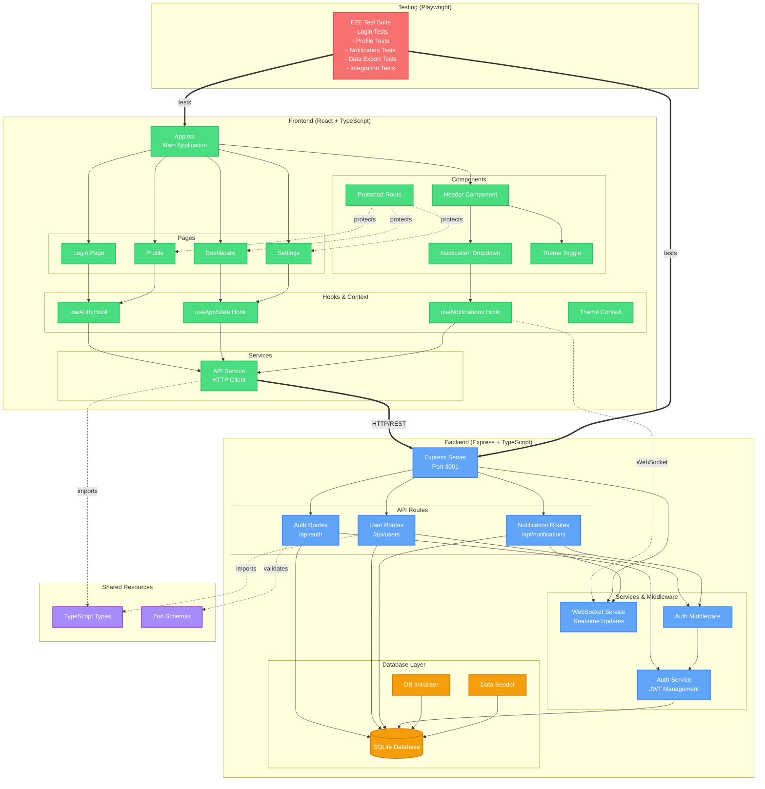
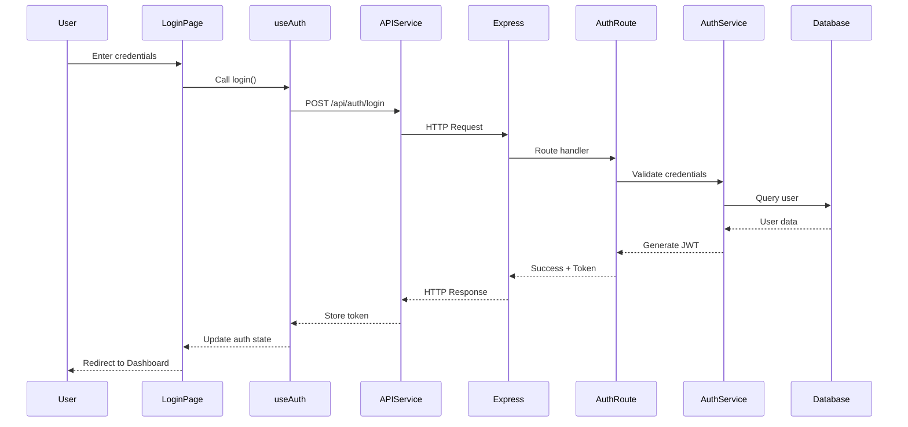
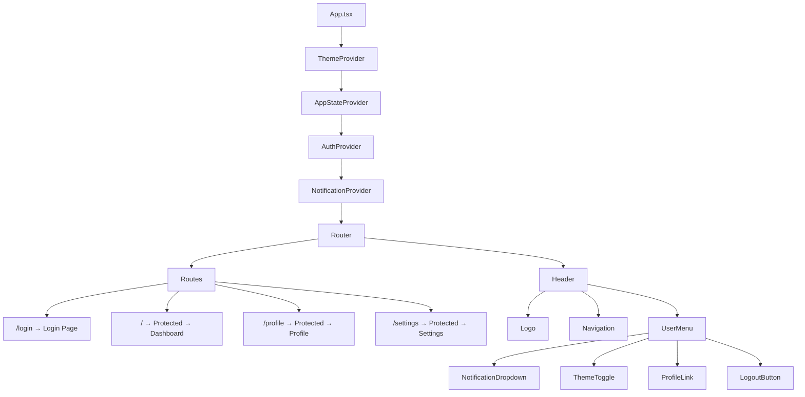
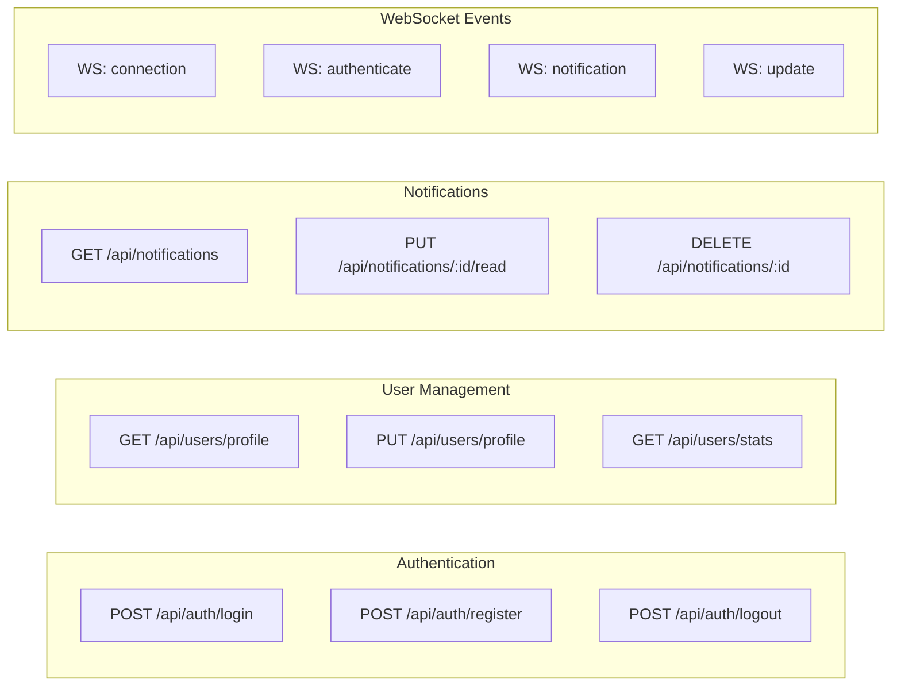
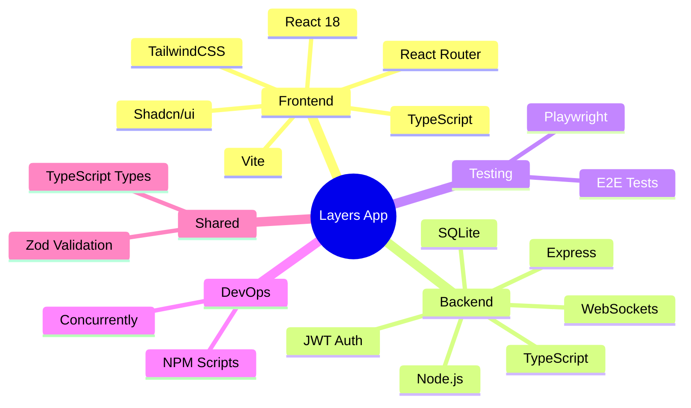
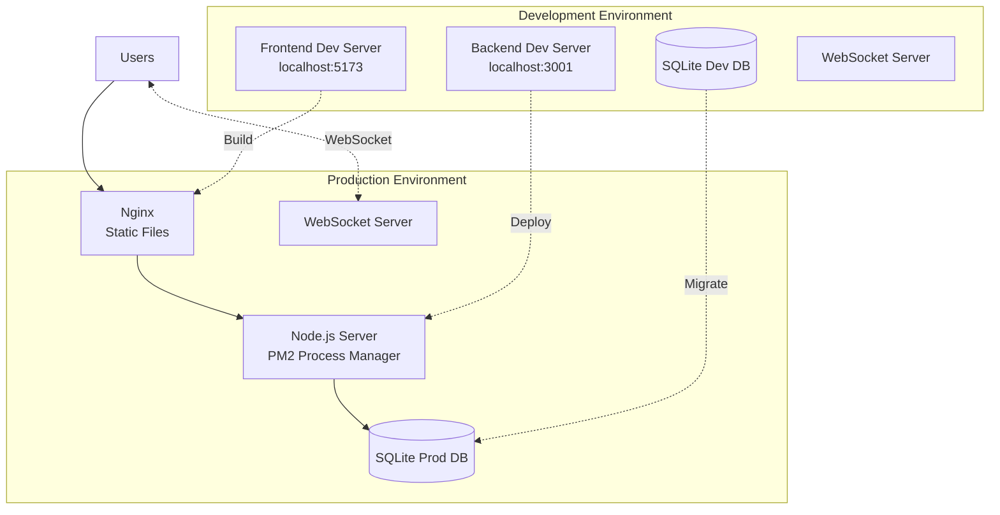

# Application Architecture

## System Overview



## Data Flow Example: User Authentication



## Component Hierarchy



## API Endpoints



## Technology Stack



## Deployment Architecture



## File Structure

```
layers-fullstack-app/
├── frontend/                 # React application
│   ├── src/
│   │   ├── components/      # Reusable UI components
│   │   ├── contexts/        # React contexts
│   │   ├── hooks/           # Custom React hooks
│   │   ├── pages/           # Page components
│   │   ├── services/        # API services
│   │   └── utils/           # Helper functions
│   └── dist/                # Production build
│
├── backend/                  # Express server
│   ├── src/
│   │   ├── database/        # Database initialization
│   │   ├── middleware/      # Express middleware
│   │   ├── routes/          # API routes
│   │   ├── services/        # Business logic
│   │   └── utils/           # Utilities
│   └── dist/                # Compiled TypeScript
│
├── shared/                   # Shared resources
│   ├── schemas.ts           # Zod validation schemas
│   └── types.ts             # TypeScript type definitions
│
└── testing/                  # E2E test suite
    └── e2e/                 # Playwright tests
```

## Key Features

- **Authentication**: JWT-based authentication with protected routes
- **Real-time Updates**: WebSocket integration for live notifications
- **Theme Support**: Dark/Light theme toggle with system preference detection
- **State Management**: Context-based state management with custom hooks
- **Type Safety**: Full TypeScript implementation with Zod validation
- **Testing**: Comprehensive E2E testing with Playwright
- **Responsive Design**: TailwindCSS for mobile-first responsive UI